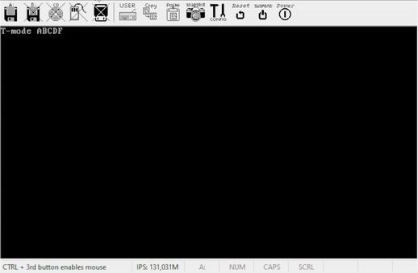

# ball512


## Запуск
Для компиляции понадобится **FASM Assembler** а для запуска **Bochs**
```
&> fasm BounceBall.asm
```
Для запуска в Bochs выберите **Disk & Boot** в окне **Bochs Start Menu** и в **First floppy image/device** выберите полученный из компиляции файл с расширением **.bin**, в разблокировавшемся **Type of floppy media** выберите соответствующий размер диска не None, параметр **Status** измените на **inserted** и запустите Bochs кнопкой **Start**
## Примечание
Что значит **T-mode ABCDF**? Это меню выбора скорости, так как она может отличатся на вашем **Bochs** для плавности<br/>
Реальный размер программы **253 Байта** но для работы в загрузачном секторе размер подставлен к **512 Байтам**<br/>
На реальном железе программа не была протестирована и результат может быть **не ожиданным и в теории фатальным**!<br/>
Код полностью за мои авторством, без помощи ИИ.
